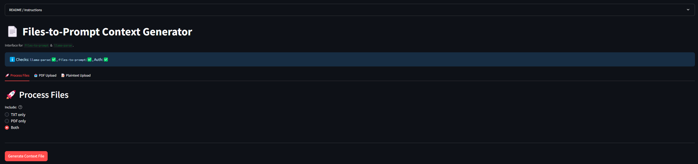
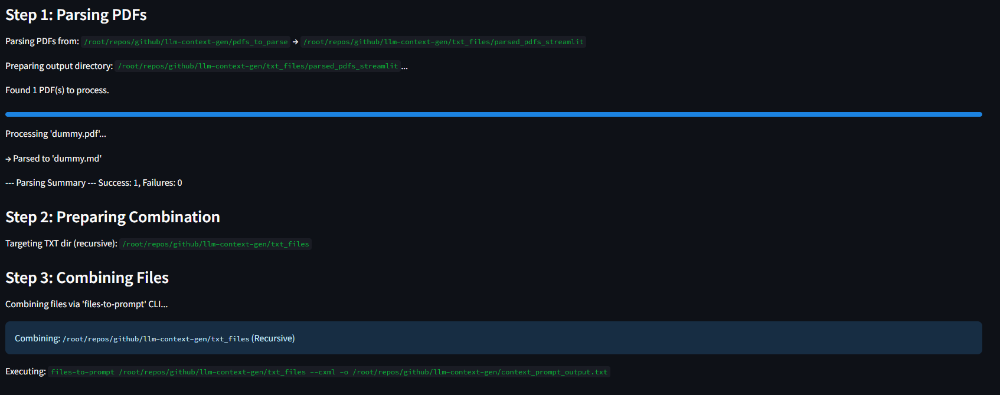
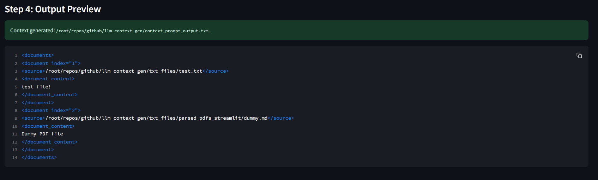
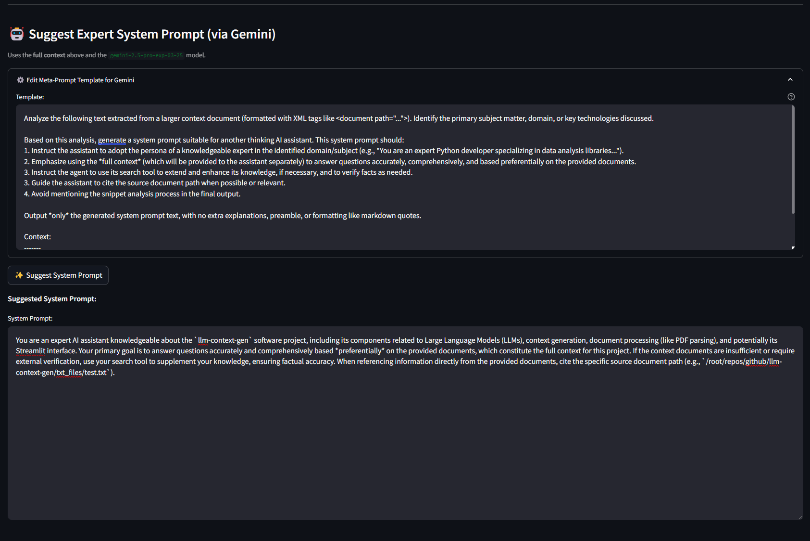
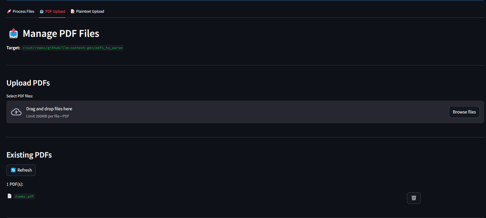
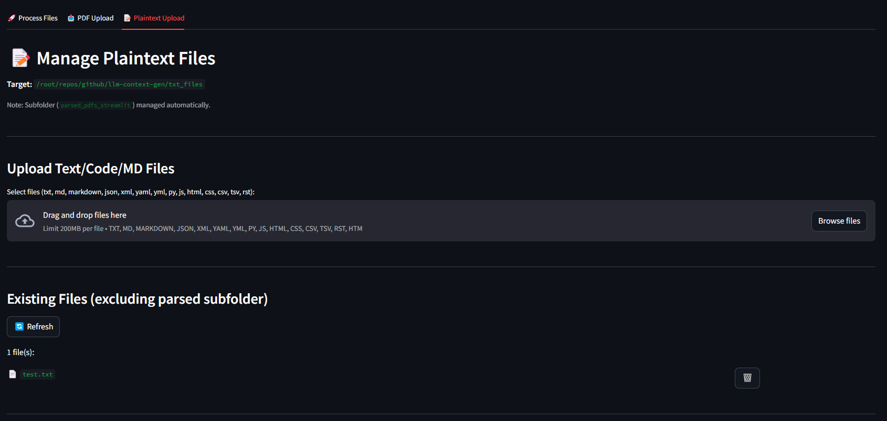

# LLM Context Generator Streamlit App

## Overview

This Streamlit application provides a user-friendly interface to aggregate content from various source files (including PDFs, plain text, Markdown, and source code) into a single, structured context file suitable for Large Language Models (LLMs). It leverages the capabilities of two external command-line tools:

1.  **`llama-parse`**: Used to extract text content from PDF documents into Markdown format via the LlamaCloud API.
2.  **`files-to-prompt`**: Used to gather text-based files from specified directories and format the combined content recursively.

Additionally, it includes a feature to **suggest an expert persona system prompt** based on the generated context, utilizing Google's Gemini AI model.

The primary goal is to simplify preparing large, diverse context sets for LLMs, outputting a single file where each source document is wrapped in Claude XML-style `<document>` tags (`files-to-prompt --cxml`).

**Key External Dependencies:**

* **PDF Parsing (`llama-parse`)**: Requires internet and a **one-time manual authentication** (`llama-parse auth`) using a LlamaCloud API key.
* **Prompt Suggestion (Gemini)**: Requires internet and a **Google AI API key** set as the `GEMINI_API_KEY` environment variable.

This app checks for necessary prerequisites but **does not store or directly handle** API keys itself.

## Features

* **Multi-Source Processing**: Handles PDF documents and various text-based files (`.txt`, `.md`, `.py`, `.js`, `.json`, `.xml`, etc.).
* **PDF Parsing Integration**: Uses `llama-parse` to convert PDF content to Markdown via LlamaCloud. Parsed files are stored in a configurable sub-directory.
* **LlamaParse Authentication Check**: Verifies if `llama-parse auth` has been completed before attempting PDF parsing.
* **Flexible Processing Modes**:
    * **Both**: Parses PDFs, then combines *all* files recursively from the main TXT directory (including parsed PDFs in the subfolder).
    * **PDF only**: Parses PDFs, then combines *only* the results from the parsed PDF sub-directory.
    * **TXT only**: Skips PDF parsing, clears old parsed results, then combines *only* files recursively from the main TXT directory.
* **File Management UI**: Upload, view, and delete PDF and Plaintext files in their respective input directories directly through the app.
* **Configurable Paths**: Set input/output directories and filenames easily via the sidebar.
* **✨ System Prompt Suggestion**: After generating context, uses Google's Gemini model (`gemini-2.5-pro-exp-03-25` as of 2025-03-27) to analyze a snippet and suggest a system prompt instructing an AI to act as a relevant expert using that context. Requires `GEMINI_API_KEY` environment variable.
* **Structured Output Format**: Generates context using Claude XML tags (`<document path="...">...</document>`).
* **In-App Previews**: Displays generated context and suggested system prompts.
* **Status & Error Feedback**: Provides messages, progress indicators, and toasts.

## Screenshots

### Mode Selection



### Progress



### Generated Context & Suggested System Prompt





### File Management





## Prerequisites (Linux Host Recommended)

1.  **Python**: Version 3.8+ recommended (`python3 --version`).
2.  **`uv` (Recommended Installer/Venv)**: A fast, modern Python package installer and virtual environment manager. While standard `pip`/`venv` works, `uv` significantly speeds up installation.
    * Install `uv`:
        ```bash
        # Linux/macOS/WSL
        curl -LsSf [https://astral.sh/uv/install.sh](https://astral.sh/uv/install.sh) | sh
        ```
        * (For other methods like `pipx` or Windows standalone, see [uv documentation](https://github.com/astral-sh/uv)).
    * Verify: `uv --version` (You might need to restart your terminal after installation).
3.  **Node.js & npm**: Required *only* for installing `llama-parse-cli`.
    * Check: `node -v` and `npm -v`
    * Install (e.g., Ubuntu/Debian): `sudo apt update && sudo apt install nodejs npm -y`
4.  **LlamaCloud API Key**: Needed *only* for the one-time `llama-parse auth` setup in your terminal. Get from [LlamaCloud](https://cloud.llamaindex.ai/).
5.  **Google AI API Key**: Needed for the "Suggest System Prompt" feature. Get from [Google AI Studio](https://aistudio.google.com/app/apikey). Must be set as the `GEMINI_API_KEY` environment variable.

## Setup Instructions (Linux Host using `uv`)

1.  **Get the Code:**
    * Save the Streamlit Python scripts (`context_generator_app.py`, `gemini_interface.py`) and `requirements.txt` into a dedicated directory.
    * Navigate there: `cd /path/to/your/app_directory`

2.  **Create Virtual Environment & Install Dependencies (using `uv`):**
    * `uv` combines environment creation and package installation.
        ```bash
        # Create a virtual environment named .venv in the current directory
        uv venv

        # Activate the environment (syntax depends on shell)
        # Linux/macOS (bash/zsh):
        source .venv/bin/activate
        # Windows (Command Prompt):
        # .venv\Scripts\activate.bat
        # Windows (PowerShell):
        # .venv\Scripts\Activate.ps1

        # Install dependencies from requirements.txt using uv
        uv pip install -r requirements.txt
        ```
    * *(Alternatively, without `requirements.txt`: `uv pip install streamlit files-to-prompt google-generativeai`)*
    * *(Using standard pip/venv: `python3 -m venv venv && source venv/bin/activate && pip install -r requirements.txt`)*

3.  **Install `llama-parse` CLI Tool:**
    * `npm install -g llama-parse-cli` (You might need `sudo` or specific npm configurations).
    * Verify: `llama-parse --version`
    * If not found, ensure npm global bin directory is in your system `PATH` and restart your terminal.

4.  **Set Google AI API Key Environment Variable:**
    * Set `GEMINI_API_KEY` **before** launching Streamlit. Choose the command for your terminal session:

        **Linux / macOS (.bashrc, .zshrc, etc.):**
        ```bash
        export GEMINI_API_KEY="YOUR_API_KEY_HERE"
        ```

        **Windows (Command Prompt - current session only):**
        ```cmd
        set GEMINI_API_KEY=YOUR_API_KEY_HERE
        ```

        **Windows (PowerShell - current session only):**
        ```powershell
        $env:GEMINI_API_KEY = 'YOUR_API_KEY_HERE'
        ```
    * Replace `YOUR_API_KEY_HERE` with your key. For persistence, add to your shell profile or system variables.

5.  **Authenticate `llama-parse` (CRITICAL ONE-TIME STEP):**
    * Links the CLI tool to your LlamaCloud account.
    * **Run manually in your terminal:**
        ```bash
        llama-parse auth
        ```
    * Enter your LlamaCloud API key (starts with `llx-`). Creates `~/.llama-parse/config.json`.

6.  **Delete `GEMINI_API_KEY.py` (Cleanup):**
    * If you previously had this file, **delete it**.

## Usage Guide

1.  **Prepare Input Folders:** Create/populate directories (e.g., `pdfs_to_parse`, `txt_files`) or configure paths in sidebar.
2.  **Activate Environment & Run App:**
    * Open terminal, navigate to the app directory.
    * **Activate the virtual environment:** (e.g., `source .venv/bin/activate`)
    * **Set Environment Variable:** Ensure `GEMINI_API_KEY` is set for the current session (Setup Step 4).
    * **Launch:** `streamlit run context_generator_app.py`
    * Open the provided local URL in your browser.
3.  **Configure Settings (Sidebar):** Adjust paths if needed. Verify directory status.
4.  **Manage Files (Tabs 2 & 3 - Optional):** Upload/view/delete source files.
5.  **Select Processing Mode (Tab 1):** Choose `TXT only`, `PDF only`, or `Both`.
6.  **Generate Context (Tab 1):** Click "Generate Context File". Monitor progress.
7.  **Review Context Output (Tab 1):** View generated file path and preview content.
8.  **Suggest System Prompt (Tab 1 - Optional):** Click "✨ Suggest System Prompt". View suggested persona prompt in the text area.
9.  **Use Output:** Copy prompt/context from UI or the generated output file.

## Troubleshooting

* **Error: `LlamaParse Auth Missing...`**: Run `llama-parse auth` manually (Setup Step 5). Check `~/.llama-parse/config.json`.
* **Error: `'llama-parse'/'files-to-prompt' command not found`**: Check tool installation and system `PATH`. Restart terminal. Verify with `--version`.
* **Error: `uv: command not found`**: Ensure `uv` is installed and its location is in PATH (Setup Step 2 / Prerequisites).
* **Error: `Configuration Error: Environment variable 'GEMINI_API_KEY' not found...`**: Ensure variable set *before* `streamlit run`. Check name/value. Check session persistence.
* **Error: `API Error: Invalid Google AI API Key...`**: Verify key value in environment variable.
* **Error: `API Error: Quota exceeded...`**: Check Google Cloud Gemini API usage/limits.
* **Error: `API Error: Model '...' not found or permission denied...`**: Check model name (`gemini-1.5-pro-latest`) and API key permissions.
* **Error: `Content generation blocked due to safety filters...`**: Google safety filters triggered. Review input/output content.
* **PDF Parsing Failures**: Check internet, LlamaCloud status/key, PDF file validity/complexity. Check UI error expander.
* **Permission Errors**: Check read/write permissions for input/output directories for the user running Streamlit.

## Dependencies

* **`streamlit`**: (Python - via `uv pip` or `pip`) Web application framework.
* **`files-to-prompt`**: (Python - via `uv pip` or `pip`) File gathering and formatting.
* **`google-generativeai`**: (Python - via `uv pip` or `pip`) Google AI SDK for Python (Gemini).
* **`uv`**: (Installer - via `curl`/`pipx`/etc.) Recommended package installer/venv manager.
* **`llama-parse-cli`**: (Node.js - via `npm install -g`) CLI for LlamaParse PDF processing. Requires manual `llama-parse auth`.
